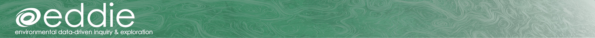
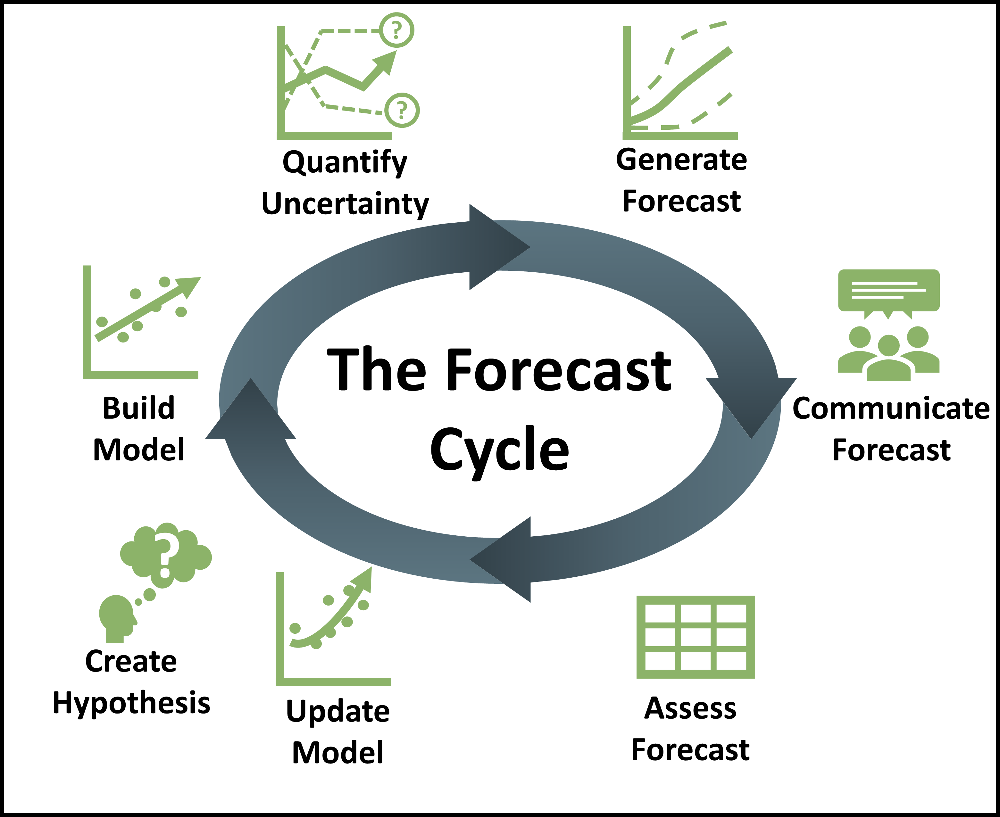
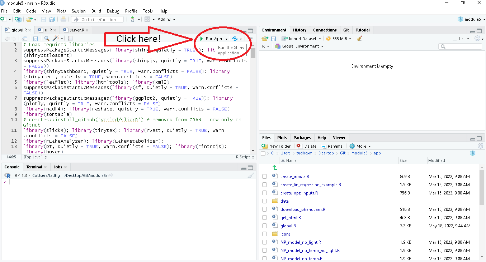

<!-- -->
# [Macrosystems EDDIE](https://serc.carleton.edu/eddie/macrosystems/index.html)
## Module 5: Introduction to Ecological Forecasting
[](https://macrosystemseddie.shinyapps.io/module5/)
[](https://mybinder.org/v2/zenodo/10.5281/zenodo.6587161/?urlpath=shiny/app/)
[](https://doi.org/10.5281/zenodo.6587161)
<a href="url"></a>
### Summary
Here is the code for running the Macrosystems EDDIE Module 5: _Introduction to Ecological Forecasting_. Below are instructions on how to access the Shiny app *via* a web browser and also a detailed guide below for launching the R Shiny App locally on your own computer. For more details about teaching this module please visit our [website](https://serc.carleton.edu/eddie/teaching_materials/modules/module5.html).

## Module Workflow
1. Using [shinyapps.io](https://macrosystemseddie.shinyapps.io/module5/)
- This option works well if there are not too many simultaneous users (<20) 
- The app generally does not take a long time to load but requires consistent internet access
- It is important to remind students that they need to save their work as they go, because this webpage will time-out after 15 idle minutes. It is frustrating for students to lose their progress, so a good rule of thumb is to get them to save their progress after completing each objective
2. The most stable option for large classes is downloading the app and running locally, see instructions [below](#running-the-shiny-app-on-your-computer)
- Once the app is downloaded and installed (which requires an internet connection), the app can be run offline locally on students’ computers
- This step requires R and RStudio to be downloaded on a student’s computer, which may be challenging if a student does not have much R experience (but this could be done prior to instruction by an instructor on a shared computer lab)
- If you are teaching the module to a large class and/or have unstable internet, this is the best option
3. As a last option, the app is accessible in any internet browser via [Binder hosting](https://mybinder.org/v2/zenodo/10.5281/zenodo.6363500/?urlpath=shiny/app/)
- Prior to class, the instructor should go to the Binder webpage and make sure that it loads (because Binder is provided as a free platform, it occasionally needs to be loaded more than once the first time)
- It takes ~5-10 minutes to load, so it’s helpful for students to start loading this webpage prior to instruction
- During instruction, this webpage occasionally times out if there are many users (even if on good internet), so this is a less stable alternative than options 1 or 2


## Accessing the Shiny App _via_ a web browser
The Shiny app for this module can be accessed through any internet browser either on [shinyapps.io](https://macrosystemseddie.shinyapps.io/module5/) or [mybinder.org](https://mybinder.org/v2/zenodo/10.5281/zenodo.6363500/?urlpath=shiny/app/).
When launching first it will take a while for the Shiny app to boot up. If you are using this in a large class (>20 users at the same time), we would recommend splitting the group into two and using **both** [shinyapps.io](https://macrosystemseddie.shinyapps.io/module5/) and [mybinder.org](https://mybinder.org/v2/gh/MacrosystemsEDDIE/module5/main?urlpath=shiny/app/).

##  Running the Shiny App on your computer
### Pre-requisites
1. Latest version of [R](https://cran.r-project.org/) installed (currently R 4.0.3 as of 2021-01-22).  
2. [RStudio](https://rstudio.com/products/rstudio/download/) installed (preferably >1.3).  

### Step 1: Download this repository
There are two options:  
1. Download the repository as a .zip file. (Easiest option).  
    a.  Click the green "Code" button on this page and select "Download ZIP".  
    b.  Unzip this file on your computer.  
2. Clone this repository into RStudio.  
		a.  Open RStudio.  
		b.  Click "File > New Project...".  
		c.  In the "Create Project dialog select "Version Control: Checkout a project from a version control repository".  
		d. Select "Git: Clone a project from a Git repository.  
		e. In the "Repository URL:" option input the URL to this repository, select where to save the project directory.  
		f. Click "Create Project".  
		g. You will then have a project with all the files from this repository.  
		
### Step 2: Install required R packages
1. The list of required of packages is detailed in the `install.R` script in this repository. Open and run this script to install the necessary packages.  
  Watch out for errors in package installation. Most can be avoided using the most up-to-date version of R (4.0.3 as of 2021-01-22).  
  Updating of current R packages on your system is recommended.

### Step 3: Launch Shiny App
1. Open either of the scripts `app/global.R`, `app/server.R` or `app/ui.R` in your console.
2. Click the "Run App" button in the Script (indicated below).  
3. This will launch the Shiny App in your default web browser or in a new RStudio window. The Shiny App is run from RStudio so you will need to keep RStudio running in the background.  
<!-- -->	

## Quickstart option
Here is an alternative way to quickly launch the Shiny app in less than a minute, but can be prone to package installation errors if your packages have not been updated recently.
```
# Step 1. Install required R packages
source("https://raw.githubusercontent.com/MacrosystemsEDDIE/module5/main/install.R")

# Step 2. Launch Shiny app
shiny::runGitHub("module5", "MacrosystemsEDDIE", ref = "main", subdir = "app")
```

## Questions & Feedback
If you have any questions, comments or feedback related to these materials you can send an email to [macrosystemseddie@gmail.com]().
 
